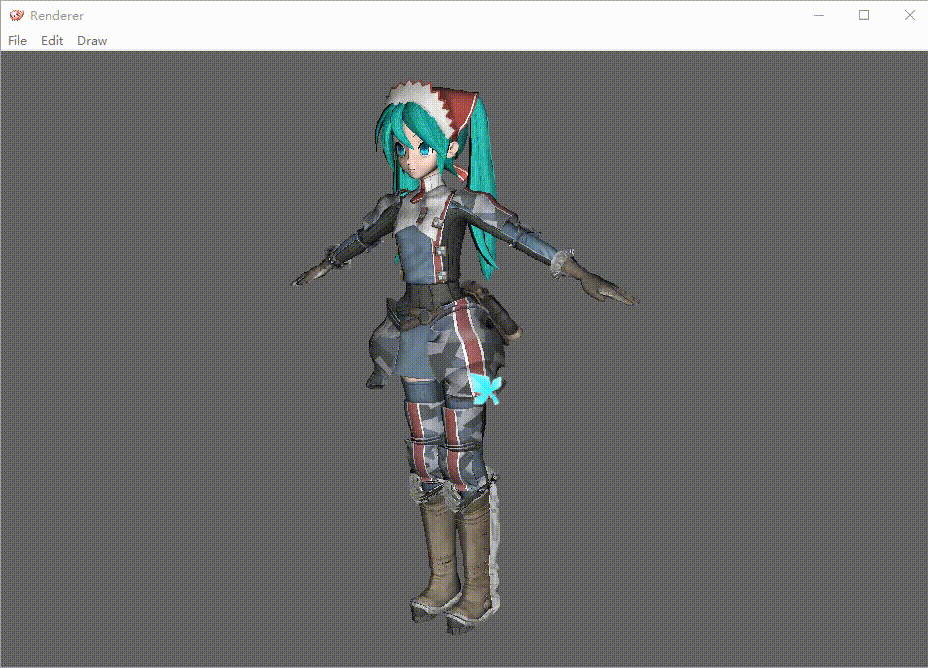
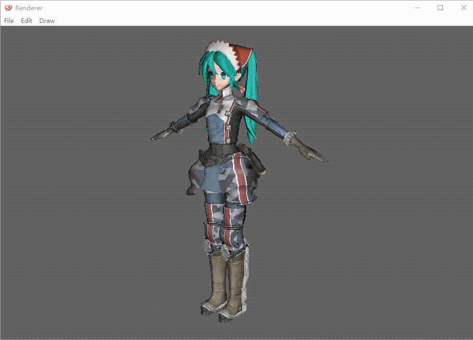
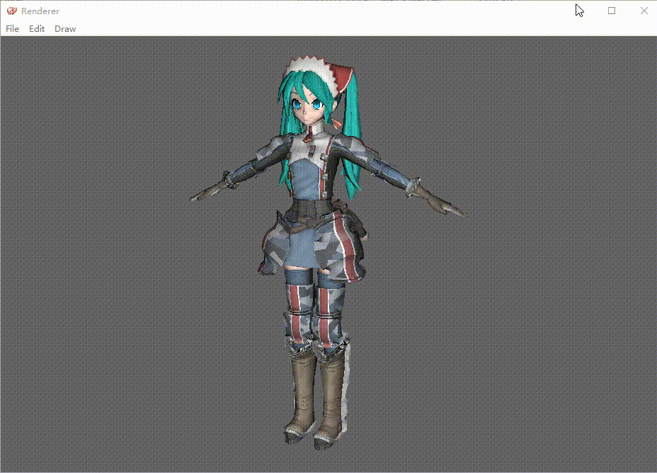
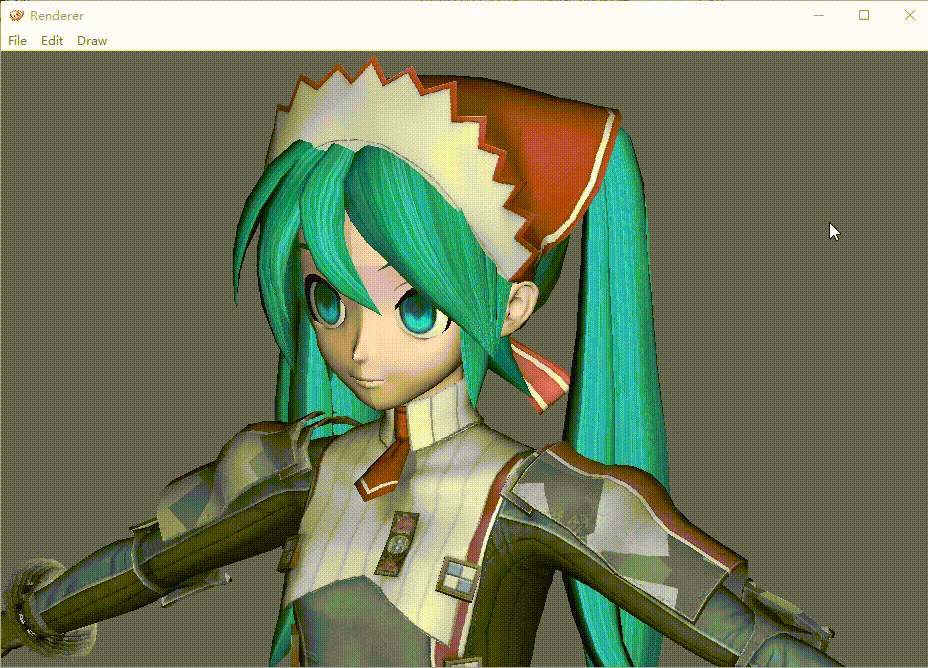

# Win32 API based Software Renderer

This project implements a fixed pipeline renderer written in C++11 and is accerated by CUDA. It contains following parts:

* Coordinate transformation (Object Coordinate -> World Coordinate -> Camera Coordinate -> Homogeneous Clipping Coordinate -> Projection Coordinate -> Viewport Coordinate
* Blinn-Phong Lighting Model
* Texture Mapping
* Super Sampling Anti-Aliasing (SSAA)
* Post-effects (Gaussian Blur, Gray-scale)

## Example

### Rotation

### Gaussian Blur

### Gray-scale

### SSAA
#### Due to the low-quality GIF, the difference may be subtle, please watch carefully.

